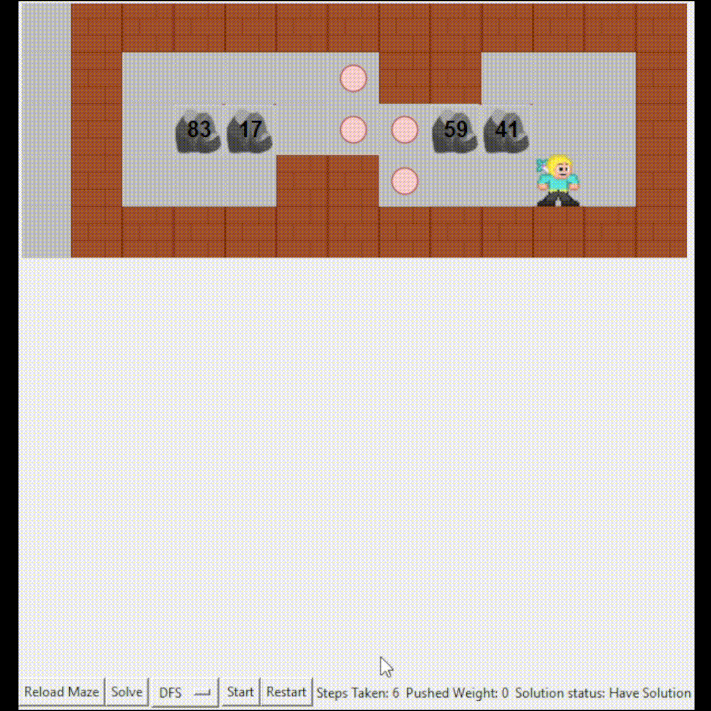

# Đồ án 1: Search

## Giới thiệu
Đây là đồ án 1 với chủ đề "Search". Ứng dụng cung cấp một giao diện GUI đơn giản cho phép người dùng thực hiện các thao tác tìm kiếm từ khóa.

## Yêu cầu
- Python 3.x
- Các thư viện Python cần thiết (được liệt kê trong file `requirements.txt`)

## Hướng dẫn cài đặt
1. **Tải**
- Clone về bằng lệnh: `git clone https://github.com/QuackPhuc/CSAI_PRJ.git`
- Hoặc tải và giải nén file `Sokoban.zip` tại mục `Releases`
2. **Tải và cài đặt các thư viện yêu cầu**  
   Chạy lệnh sau để cài đặt các thư viện từ file `requirements.txt`:
   ```bash
   pip install -r requirements.txt

## Hướng dẫn sử dụng GUI
Chạy file `main.py` để sử dụng GUI.
### Input
- File input có dạng `input-[number].txt`. Ví dụ: `input-01.txt`.
- File input mô tả một bản đồ trò chơi dạng lưới, với dòng đầu chứa trọng số của từng tảng đá theo thứ tự từ trái sang phải, từ trên xuống dưới. Các dòng tiếp theo là các ký hiệu đại diện cho các yếu tố trong trò chơi như: 
   - Wall: "#"
   - Stone: "$",
   - Ares: "@",
   - Switch: ".",
   - Ares on Switch: "+",
   - Stone on Switch: "*"
- Ví dụ: `input-01.txt`
   ```
   83 17 59 41
   ############
   #    .##   #
   # $$@..$$  #
   #   ##.    #
   ############
   ```
### Load Maze/Reload Maze
- Sử dụng nút `Load Maze` hoặc `Reload Maze` (nếu đã tải bản đồ trước đó) để tải bản đồ trò chơi từ file input.

   

### Solve
- Sau khi đã tải thành công bản đồ. Dùng nút `Solve` để tiến hành tìm lời giải. Trạng thái của quá trình giải sẽ hiển thị ở góc dưới bên phải (*Solution status*)
- Có thể thay đổi thuật toán tìm đường bằng cách click và chọn thuật toán mong muốn ở ô thuật toán bên cạnh. Thuật toán mặc định là Breadth First Search (BFS)
- Sau khi giải xong, kết quả sẽ được lưu lại tại `Output/output-[number].txt`. Trong đó `[number]` là giá trị `[number]` trong file input (`input-[number].txt`).

   

### Start/Pause
- Sau khi tiến hành tìm lời giải và có lời giải (*Solution status = Having Solution*), có thể ấn nút `Start` để bắt đầu mô tả trực quan lời giải.
- Trong quá trình thực hiện có thể ấn `Pause` để tạm dừng.

   

### Restart
- Ấn `Restart` sẽ đưa quá trình mô tả lời giải về lại trạng thái ban đầu.

   
